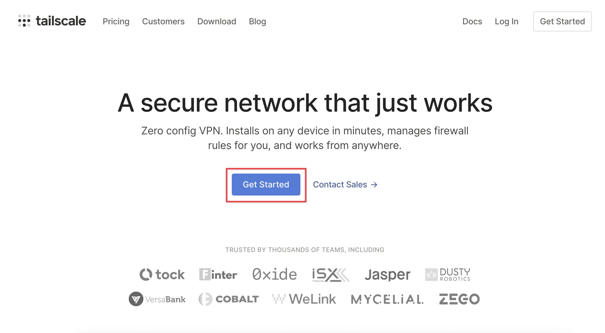
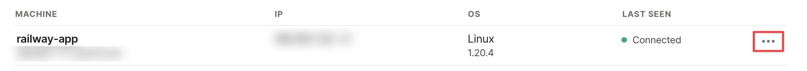

# Tailscale VPN

## Info

This is an easy-to-use example for creating your own private VPN on Railway.

## Steps

1. Create an account on [tailscale.com](https://tailscale.com/).

2. Follow the instructions to install Tailscale on your own device that you want to connect to the VPN.
3. Go to the **Settings** tab, and to go **Keys**. Then, click on **Generate auth key...**.

4. Select the options for making it **Ephemeral** and **Reusable**, then click **Generate key**.

5. Copy the key that it gives you. It looks something like `tskey-h1M24bEnVnd-n8J2LteLAFJLm8HQn3m`. (This is a fake key, don't bother trying it.)

6. Configure this starter, and put in the key as `TAILSCALE_AUTHKEY`.
7. Wait for it to finish deploying, and go to [the admin page](https://login.tailscale.com/admin/machines).
8. Where it says `railway-app`, click on the triple dots.

9. Then, click **Edit route settings...**. Then, turn on the option that says **Use as exit node**.

10. Configure your computer to use the exit node, and you're done!