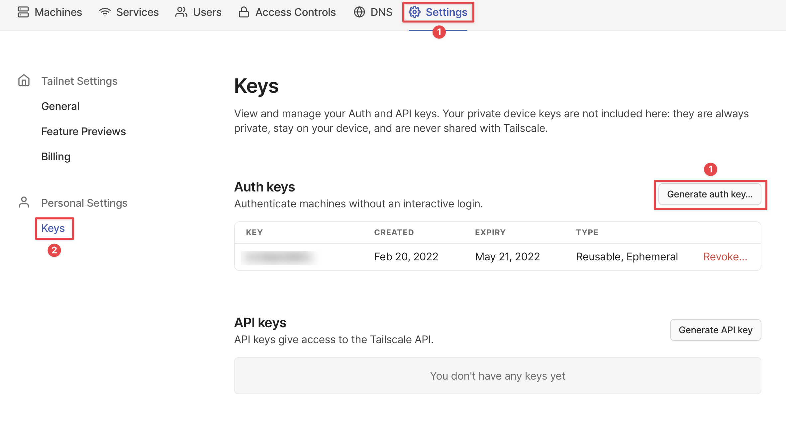
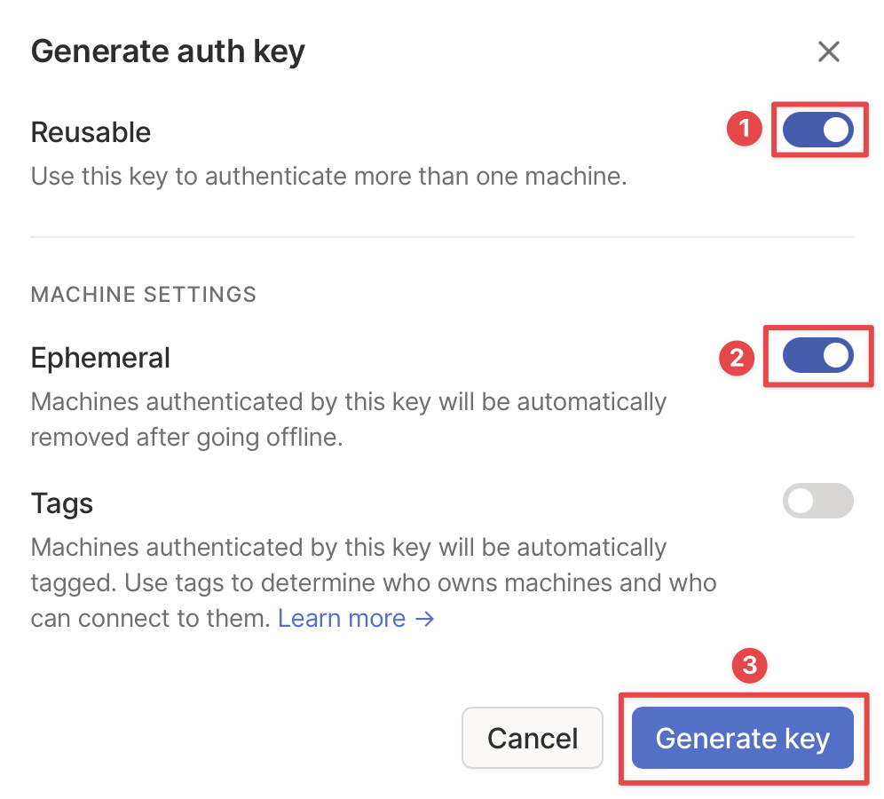
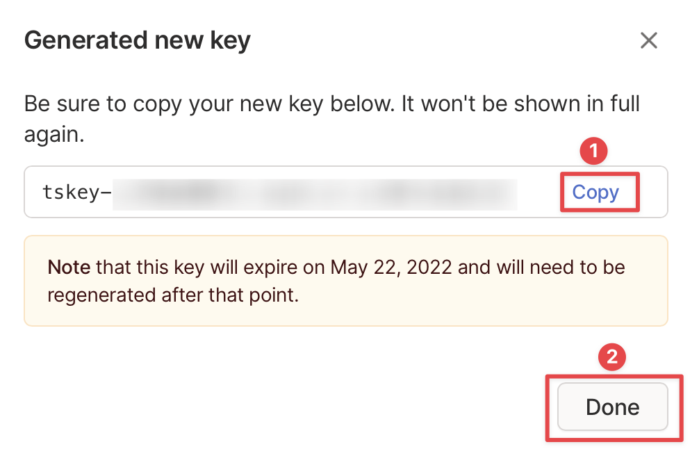
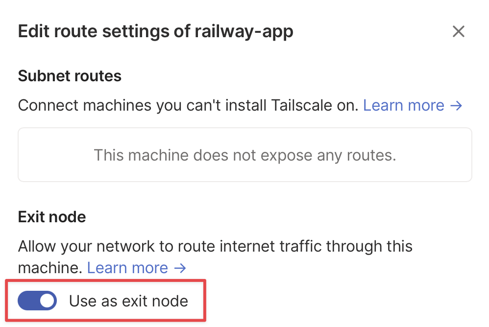

# Tailscale VPN

## Info

This is an easy-to-use example for creating your own private VPN on Railway.

## Steps

1. Create an account on [tailscale.com](https://tailscale.com/).
2. Follow the instructions to install tailscale on your own device that you want to connect to the VPN.
3. Go to the `settings` tab, and to go `keys`. Then, click on `Generate auth key...`

4. Generate an auth key, and check the options for making it **ephemeral** and **reusable**.

5. Copy the key that it generates (It looks something like: `tskey-<key>`).

6. Configure this starter, and put in the key as `TAILSCALE_AUTHKEY`.
7. Wait for it to finish deploying, and go to [the admin page](https://login.tailscale.com/admin/machines).
8. Where it says railway-app, click on the triple dots, and click `Edit route settings...`. Then, turn on the option that says `Use as exit node`.

9. Configure your computer to use the exit node, and you're done!